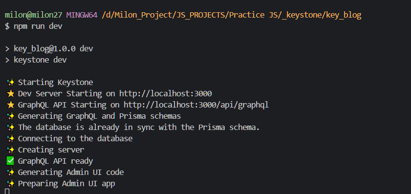

## how to setup a keystone v6 project with typescript and pnpm

```bash
# create a node js project
npm i --init

# install packages (required) [make sure you have pnpm]
pnpm i @keystone-6/core typescript dotenv @prisma/client
pnpm i -D prisma

# install packages (optional)
# Auth
pnpm i @keystone-6/auth
# Rich Text editors
pnpm i @keystone-6/fields-document

```

## project setup
- create few scripts in **package.json** file
```json
{
  "name": "key_blog",
  "version": "1.0.0",
  "description": "",
  "main": "index.js",
  "scripts": {
    "dev": "keystone dev",
    "start": "keystone start",
    "build": "keystone build",
    "postinstall": "keystone postinstall"
  },
  "keywords": [],
  "author": "milon27",
  "license": "ISC",
  "dependencies": {
    "@keystone-6/core": "^2.3.0",
    "@prisma/client": "^4.4.0",
    "dotenv": "^16.0.3",
    "typescript": "^4.8.4"
  },
  "devDependencies": {
    "prisma": "^4.4.0"
  }
}

```

- create **tsconfig.json** file
```json
{
    "compilerOptions": {
        "target": "esnext",
        "module": "commonjs",
        "strict": true,
        "noEmit": true,
        "esModuleInterop": true,
        "forceConsistentCasingInFileNames": true
    }
}
```

- create a file called **.env**
```bash
DB_URL="mysql://root@localhost/keystone"
```

- create a file called **keystone.ts**
- connect database from **.env**
- create a user list
```ts
import { config as envConfig } from 'dotenv'
import { config, list } from '@keystone-6/core'
import { text } from '@keystone-6/core/fields'

envConfig()

export default config({
    db: {
        provider: 'mysql',
        url: process.env.DB_URL,
    },
    lists: {
        User: list({
            fields: {
                name: text({ validation: { isRequired: true } }),
                email: text({ validation: { isRequired: true }, isIndexed: 'unique' }),
            },
        }),
    }
});
```

- run the project in **dev mode**
```bash
npm run dev
```

